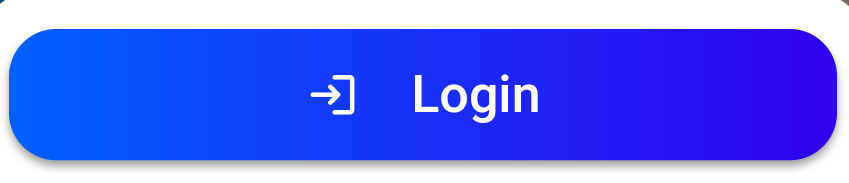
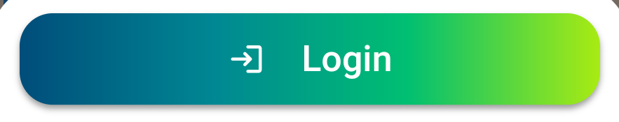

# Elevated Gradient Button Flutter
Elevated Background Gradient with Icon Button For Flutter


You can use it :

```
GradientBackgroundButton(
    materialStatePropertyShape: MaterialStateProperty.all(RoundedRectangleBorder(borderRadius: BorderRadius.circular(18.0))),
    icon: const Icon(Icons.login_rounded, color: Colors.white, size: 20),
    leftIcon: 20,
    child: Text('Login', style: TextStyle(fontSize: 18, color: Colors.white)),
    gradient: const LinearGradient(
      colors: <Color>[Color(0xFF0060ff), Color.fromARGB(255, 48, 0, 238)],
    ),
    onPressed: () => print('Clicked')),
```


```
GradientBackgroundButton(
    materialStatePropertyShape: MaterialStateProperty.all(RoundedRectangleBorder(borderRadius: BorderRadius.circular(18.0))),
    icon: const Icon(Icons.login_rounded, color: Colors.white, size: 20),
    leftIcon: 20,
    child: Text('Login', style: TextStyle(fontSize: 18, color: Colors.white)),
    gradient: const LinearGradient(
      colors: <Color>[ Color(0xff004d7a), Color(0xff008793), Color(0xff00bf72), Color(0xffa8eb12)],
    ),
    onPressed: () => print('Clicked')),
```


## Credit

Modified Code From : https://stackoverflow.com/a/52244149
If you use `Elevated` Button in place of `InkWell` then there's an issue with Background of `Elevated` Button and `InkWell` is not as good as `Elevated` and `TextButton`
